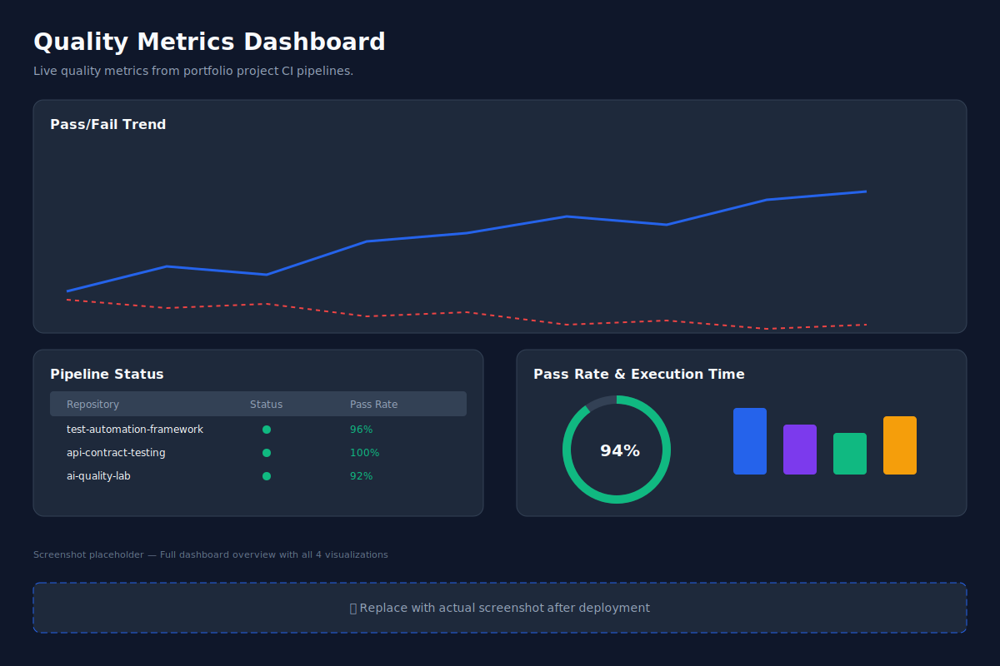
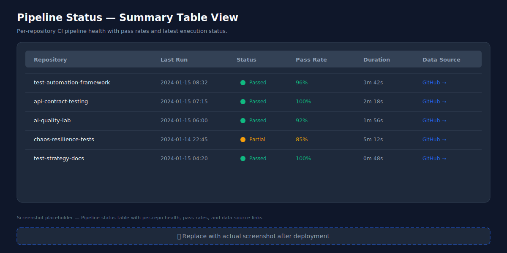
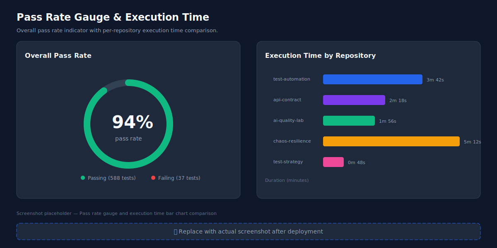

# QA Engineer Portfolio

<p align="center">
  
</p>

A comprehensive QA Engineering portfolio built with Next.js 14, showcasing test automation, API contract testing, AI-driven quality tools, chaos engineering, and data-driven quality metrics — all deployed as a static site on GitHub Pages.

## 🚀 Live Site

**[https://USERNAME.github.io/portfolio-site](https://USERNAME.github.io/portfolio-site)**

## ✨ Features

- **About** — Personal philosophy and video introduction
- **Case Studies** — 4 detailed narratives with quantified metrics
- **Quality Dashboard** — Live CI/CD metrics from portfolio repositories
- **Blog** — Technical articles on testing topics
- **Contact** — Form with validation and downloadable resume

---

## 📊 Quality Metrics Dashboard

The dashboard pulls live CI/CD data from portfolio project pipelines and visualizes quality trends, pass rates, execution times, and pipeline health.

### Dashboard Screenshots

#### Full Dashboard Overview

All 4 metric visualizations — pass/fail trend chart, pipeline status table, pass rate gauge, and execution time comparison — rendered on a single page.



#### Pipeline Status Table

Per-repository CI pipeline health showing latest run status, pass rate percentage, execution duration, and data source hyperlinks.



#### Pass Rate Gauge & Execution Time

Overall portfolio pass rate displayed as a circular gauge alongside a horizontal bar chart comparing execution times across repositories.



> **Note:** These are SVG placeholder images representing each dashboard view. Replace with actual browser screenshots after deployment.

---

## 🏗 Tech Stack

| Layer | Technology |
|-------|-----------|
| Framework | Next.js 14 (App Router) |
| Styling | Tailwind CSS 3 |
| Charts | Chart.js |
| Content | MDX |
| Deployment | GitHub Pages (static export) |
| CI/CD | GitHub Actions |

## 📁 Project Structure

```
portfolio-site/
├── src/
│   ├── app/           # Pages (About, Case Studies, Dashboard, Blog, Contact)
│   ├── components/    # Reusable UI components
│   ├── content/       # MDX case studies and blog posts
│   ├── lib/           # Utilities, constants, API helpers
│   └── types/         # TypeScript type definitions
├── public/
│   ├── data/          # metrics.json (auto-updated by CI)
│   └── images/        # Dashboard screenshots
└── .github/workflows/ # Deploy and metrics collection
```

## 🛠 Getting Started

```bash
# Clone the repository
git clone https://github.com/USERNAME/portfolio-site.git
cd portfolio-site

# Install dependencies
npm install

# Run development server
npm run dev

# Build static export
npm run build
```

## 📈 Connected Repositories

The dashboard aggregates metrics from:

| Repository | Description |
|-----------|-------------|
| [test-automation-framework](https://github.com/USERNAME/test-automation-framework) | Playwright + TypeScript E2E tests |
| [api-contract-testing](https://github.com/USERNAME/api-contract-testing) | REST Assured + Pact contract tests |
| [ai-quality-lab](https://github.com/USERNAME/ai-quality-lab) | LLM evaluation, self-healing locators, prompt regression |
| [chaos-resilience-tests](https://github.com/USERNAME/chaos-resilience-tests) | Docker + Toxiproxy failure injection |
| [test-strategy-docs](https://github.com/USERNAME/test-strategy-docs) | Fintech test strategy documentation |
| [open-source-bug-reports](https://github.com/USERNAME/open-source-bug-reports) | Curated bug report examples |

## 📄 License

MIT

---

<p align="center">
  <a href="https://USERNAME.github.io/portfolio-site">← Back to Portfolio</a>
</p>
